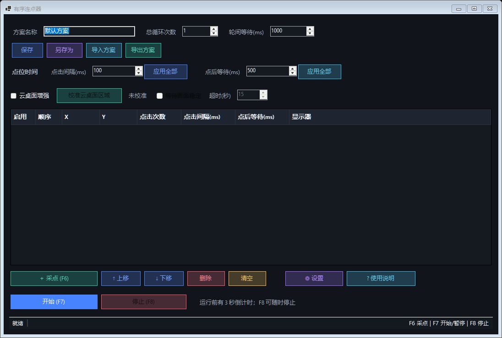

# 有序连点器

Windows 10/11 x64 免费开源桌面连点器，无授权码和联网验证。支持有序点位、批量时间设置、单点独立参数、总循环次数、方案文件保存/另存为/导入/导出、可配置全局热键、云桌面相对坐标、长流程计数校验、断点继续、DPI 缩放及多显示器。



## 下载与运行

普通用户请从仓库的 **Releases** 页面选择以下版本：

- 安装版：`ordered-clicker-setup-v1.3.1.exe`，双击后按向导安装，适合日常使用。
- 便携版：`ordered-clicker-portable-v1.3.1.zip`，解压后直接运行，适合临时使用。

安装版默认安装到当前用户目录，不需要管理员权限，并可创建开始菜单和桌面快捷方式。

## 快速使用

1. 打开 `有序连点器.exe`。
2. 点击“采点模式”。
3. 将鼠标移动到目标位置，按 `F6` 依次记录多个点。
4. 在“点位时间”栏设置点击间隔或点后等待，点击对应“应用全部”可批量修改所有点。
5. 在表格中单独修改特殊点位；单行修改只对当前点生效。
6. 新采集点会继承“点位时间”栏中的当前数值。
7. 设置总循环次数和轮间等待时间。
8. 按 `F7` 开始，运行过程中再次按该键可暂停或继续。
9. 按 `F8` 可随时停止。
10. 点击“⚙ 设置”可切换主题或修改快捷键，点击“? 使用说明”可查看完整操作细节。

正式产品目录中同时提供：

- `有序连点器-使用说明.pdf`
- `有序连点器-使用说明.html`
- `有序连点器-视频演示.mp4`

## 热键

- `F6`：采点模式开启时记录当前鼠标位置。
- `F7`：开始、暂停或继续。
- `F8`：立即停止。

在“⚙ 设置”中可选择“简洁模式”或“兼容模式”，也可以点击快捷键输入框后直接按键自定义。无修饰键时只允许 `F6` 到 `F12`，组合键可使用 `Ctrl`、`Alt`、`Shift` 或 `Win`，三个操作不能重复。

保存新快捷键时，程序会检测重复和系统占用。如果新组合注册失败，会恢复修改前仍可用的快捷键并显示冲突提示；主界面按钮始终可用。启动时发现快捷键被其他程序占用，也会提示用户进入设置修改。

## 云桌面与复杂流程

- 在浏览器内使用云桌面时，勾选“云桌面增强”，点击“校准云桌面区域”，依次用 `F6` 记录远程画面的左上角和右下角。
- 云桌面点位保存为区域内相对坐标。浏览器窗口位置或大小变化后，只需重新校准区域，不必重新采集所有点。
- 可启用“等待画面稳定”，用于远程页面加载时间不固定的流程；超时后程序会暂停，由用户确认后继续或停止。
- 开始前会显示总行数、启用行、禁用行、循环数、计划点次和计划点击数。实际完成数不匹配时不会显示“全部完成”。
- 停止或异常后可从精确断点继续，也可点击“重新开始”。执行日志保存在 `%LocalAppData%\OrderedClicker\logs`。

## 配置文件

方案保存到：

```text
%LocalAppData%\OrderedClicker\profiles
```

“保存”覆盖当前已绑定的方案；“另存为”选择新的 JSON 路径，并将其设为后续保存目标；“导入方案”会先校验并要求确认，导入后作为本机副本，不覆盖来源文件；“导出方案”将当前完整方案写入指定 JSON 文件，但不改变当前保存位置。导入损坏或不兼容的配置时程序会显示错误，不会覆盖现有点位。

界面主题和快捷键设置保存到：

```text
%LocalAppData%\OrderedClicker\settings.json
```

内置“极光科技、经典深色、海洋蓝、翡翠绿、明亮模式”五套主题。设置文件不存在或损坏时自动使用“极光科技”和默认快捷键。旧版仅包含主题的设置文件可直接兼容。

## DPI 和多显示器

- 程序使用 `PerMonitorV2` DPI 感知，按物理屏幕坐标采点和点击。
- 支持副显示器位于主显示器左侧或上方产生的负坐标。
- 采点后如果显示器位置、分辨率或缩放比例发生变化，开始前会提示重新采点。
- 普通模式使用绝对坐标；云桌面增强模式使用已校准区域内的相对坐标。
- 鼠标移动使用虚拟桌面绝对输入，并校验实际落点；最终偏差超过 2 像素时停止并报告。

## 权限和限制

- 普通权限程序不能可靠控制以管理员身份运行的目标程序。需要时请让两者使用相同权限。
- 当前安装包尚未进行商业代码签名，Windows 可能显示“未知发布者”或 SmartScreen 提示。请仅从本仓库 Releases 下载，并使用随包提供的 `SHA256SUMS.txt` 核对文件。
- 游戏、反作弊程序、远程桌面或安全软件可能屏蔽模拟输入。
- 运行时用户主动移动鼠标可能影响点击结果，默认按 `F8` 可紧急停止。

## 构建

源码构建需要 Windows 10/11 x64、PowerShell 7 和 .NET 10 SDK。构建脚本会优先使用 `.tools\dotnet` 下的本地 SDK；如果该目录不存在，则使用系统安装的 `dotnet`。生成安装版还需要 Inno Setup 7。

完整产品包还需要指导成品目录中存在以下三个文件：

```text
有序连点器-使用说明.pdf
有序连点器-使用说明.html
有序连点器-完整操作教程.mp4
```

视频属于本地生成产物，不提交到 Git。干净检出需要先按 `scripts/guide` 中的生成脚本制作视频，或通过 `-GuideSourceDirectory` 指向已有成品目录。

```powershell
.\scripts\dotnet.ps1 build .\OrderedClicker.sln -c Release '-m:1'
.\scripts\dotnet.ps1 run --project .\tests\OrderedClicker.Tests\OrderedClicker.Tests.csproj -c Release
.\scripts\publish.ps1
pwsh -NoProfile -File .\scripts\build-installer.ps1 `
  -Version 1.3.1 `
  -ProductDirectory "D:\专用工具\连接器产品" `
  -GuideSourceDirectory "D:\专用工具\连点器\操作指导"
```

应用发布结果位于 `publish\win-x64`，安装器中间产物位于 `publish\packages`。可执行文件和视频成品不提交到源码仓库，统一通过 GitHub Releases 分发。
