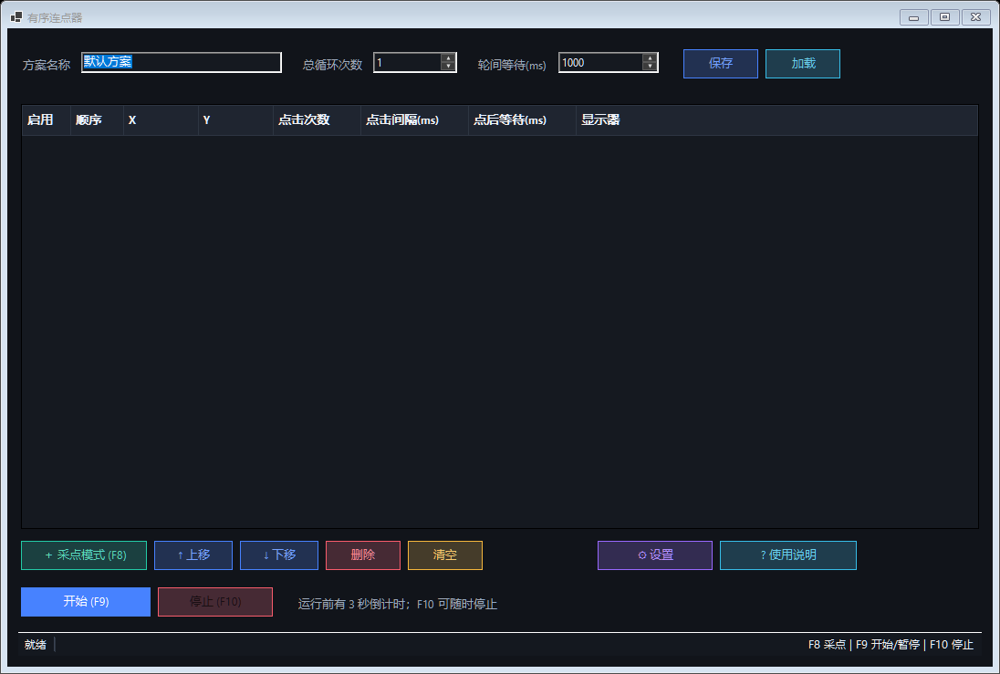

# 有序连点器

Windows 10/11 x64 桌面连点器。支持有序点位、单点独立点击次数和等待时间、总循环次数、全局热键、DPI 缩放及多显示器。



## 下载与运行

普通用户请从仓库的 **Releases** 页面选择以下版本：

- 安装版：`ordered-clicker-setup-v1.0.1.exe`，双击后按向导安装，适合日常使用。
- 便携版：`ordered-clicker-portable-v1.0.1.zip`，解压后直接运行，适合临时使用。

安装版默认安装到当前用户目录，不需要管理员权限，并可创建开始菜单和桌面快捷方式。

## 快速使用

1. 打开 `有序连点器.exe`。
2. 点击“采点模式”。
3. 将鼠标移动到目标位置，按 `F8` 依次记录多个点。
4. 在表格中设置每个点的点击次数、点击间隔和点后等待时间。
5. 设置总循环次数和轮间等待时间。
6. 按 `F9` 开始，运行过程中再次按 `F9` 可暂停或继续。
7. 按 `F10` 可随时停止。
8. 点击“⚙ 设置”可切换界面主题，点击“? 使用说明”可查看完整操作细节。

正式产品目录中同时提供：

- `有序连点器-使用说明.pdf`
- `有序连点器-使用说明.html`
- `有序连点器-视频演示.mp4`

## 热键

- `F8`：采点模式开启时记录当前鼠标位置。
- `F9`：开始、暂停或继续。
- `F10`：立即停止。

如果热键被其他程序占用，程序会在启动时提示。按钮操作仍然可用。

## 配置文件

方案保存到：

```text
%LocalAppData%\OrderedClicker\profiles
```

配置使用 JSON 格式。加载损坏配置时程序会显示错误，不会覆盖现有点位。

界面主题设置保存到：

```text
%LocalAppData%\OrderedClicker\settings.json
```

内置“极光科技、经典深色、海洋蓝、翡翠绿、明亮模式”五套主题。设置文件不存在或损坏时自动使用“极光科技”。

## DPI 和多显示器

- 程序使用 `PerMonitorV2` DPI 感知，按物理屏幕坐标采点和点击。
- 支持副显示器位于主显示器左侧或上方产生的负坐标。
- 采点后如果显示器位置、分辨率或缩放比例发生变化，开始前会提示重新采点。
- 绝对坐标不会自动按比例换算，避免静默点击错误位置。

## 权限和限制

- 普通权限程序不能可靠控制以管理员身份运行的目标程序。需要时请让两者使用相同权限。
- 当前安装包尚未进行商业代码签名，Windows 可能显示“未知发布者”或 SmartScreen 提示。请仅从本仓库 Releases 下载，并使用随包提供的 `SHA256SUMS.txt` 核对文件。
- 游戏、反作弊程序、远程桌面或安全软件可能屏蔽模拟输入。
- 运行时用户主动移动鼠标可能影响点击结果，`F10` 可紧急停止。

## 构建

源码构建需要 Windows 10/11 x64 和 .NET 10 SDK。构建脚本会优先使用 `.tools\dotnet` 下的本地 SDK；如果该目录不存在，则使用系统安装的 `dotnet`。生成安装版还需要 Inno Setup 7。

```powershell
.\scripts\dotnet.ps1 build .\OrderedClicker.sln -c Release '-m:1'
.\scripts\dotnet.ps1 run --project .\tests\OrderedClicker.Tests\OrderedClicker.Tests.csproj -c Release
.\scripts\publish.ps1
.\scripts\build-installer.ps1 `
  -Version 1.0.1 `
  -ProductDirectory "D:\专用工具\连电器产品" `
  -GuideSourceDirectory ".\操作指导"
```

应用发布结果位于 `publish\win-x64`，安装器中间产物位于 `publish\packages`。可执行文件和视频成品不提交到源码仓库，统一通过 GitHub Releases 分发。
